# Project of Data Visualization (COM-480)

| Student's name | SCIPER |
| -------------- | ------ |
| David Friou | 327687 |
| Elias Hörnberg | 384928 |
| Wesley Monteith-Finas  | 324745 |

[Milestone 1](#milestone-1) • [Milestone 2](#milestone-2) • [Milestone 3](#milestone-3)

You can find our website [here](https://com-480-data-visualization.github.io/project-2024-DisasterClass/) ;)

## Milestone 1 (29th March, 5pm)

**10% of the final grade**

### 📋 Dataset

We have selected the [Emergency Events Database (EM-DAT)](https://www.emdat.be/) for our analysis. This database encompasses records of over 26,000 mass disasters worldwide spanning from 1900 to the present day. Established in 1988 through collaboration between the Centre for Research on the Epidemiology of Disasters (CRED) and the World Health Organization (WHO), EM-DAT consolidates data from diverse sources including UN agencies, non-governmental organisations, and research institutes. CRED, affiliated with the University of Louvain and supported by the United States Agency for International Development (USAID), upholds the data's credibility and reliability.

It is worth noting that events predating 2000 are categorised as _"Historic"_ by CRED and may exhibit a lower level of quality. This phenomenon, termed _time bias_, is elucidated further [here](https://doc.emdat.be/docs/known-issues-and-limitations/specific-biases/#time-bias). Therefore, we may implement a filtering mechanism to exclude data prior to 2000. This approach enables us to switch between two versions of the dataset during visualisation: one encompassing historic data to discern long-term trends, and another focusing on more recent and presumably higher-quality records.

The dataset comprises 46 columns, covering various aspects such as disaster type, geographic location, magnitude, human and material consequences, and governmental responses. While 17 columns are mandatory, others are optional, therefore for certain visualisations, we may opt to utilise a subset of the dataset to highlight specific dynamics of interest.

CRED defines a disaster as _“a situation or event that overwhelms local capacity, necessitating a request at the national or international level for external assistance; it is an unforeseen and often sudden event that causes great damage, destruction and human suffering.”_  The disasters in this dataset meet at least one of the following criteria: 
- 10 or more reported deaths
- 100 or more people affected
- Declaration of a state of emergency
- Call for international assistance.

### ❓ Problematic

Our main goal with the visualisation is to raise awareness about disasters affecting the world, focusing on both natural phenomena like earthquakes and technological mishaps such as industrial accidents. Especially, we want to shed light on such events affecting the world negatively that fortunate people living in less affected areas might not fully understand the scale of. By fostering heightened awareness, our goal is to inspire greater humanitarian aid donations and support for post-disaster reconstruction efforts.

The key visualisations we prioritise include:
- Show how different categories of disasters are connected. For example, how earthquakes might cause a tsunami. We'll use graphs to make this easier to understand.
- Present the timeline of disasters around the world and its impact to illustrate most affected areas. Possible variables to show related to the disasters could be the number of people affected and economic costs. 
- The most impactful disasters through history, both individual ones and by category, which could be measured based on different variables as victims or economic costs. 
- Identify which time of year most disasters occur to see if there are correlations between seasons and certain disasters. 
- Examining disparities in international responses to disasters, such as disparities in humanitarian aid allocation between different regions of the world.

The target audience for these visualisations, in addition to everyone we want to raise awareness among, are researchers in natural disasters and geography students and educators. These groups might have an idea of the data, but for deeper understanding, great visualisations are important. Accessible visual representations of historical disaster data and their geographical spread will aid anyone interested in the subject in developing a more robust understanding.

### 📊 Exploratory Data Analysis

Regarding the pre-processing: not much data cleaning is necessary, but we will have to use subsets of the data when plotting different variables against one another because non mandatory variables have a significant amount of missing values. Additionally the idea to drop lesser quality historical data prior to the 2000s, will be explored as mentioned in the Dataset questions.

Please refer to the `exploratory_data_analysis.ipynb` to see how we delved into the data. Here are some of the figures we generated:

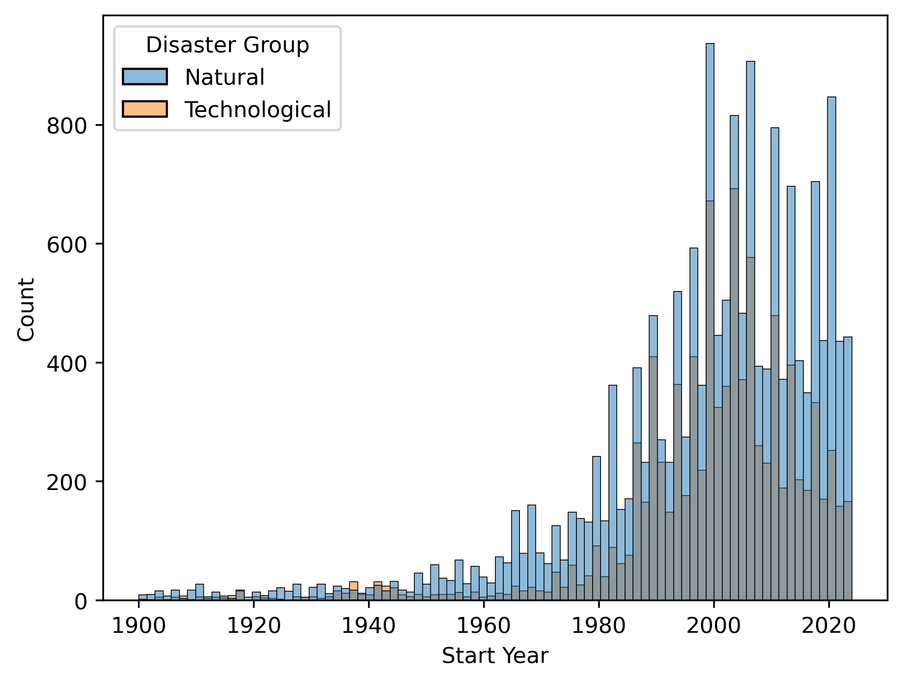
*Disaster Counts per Year.*

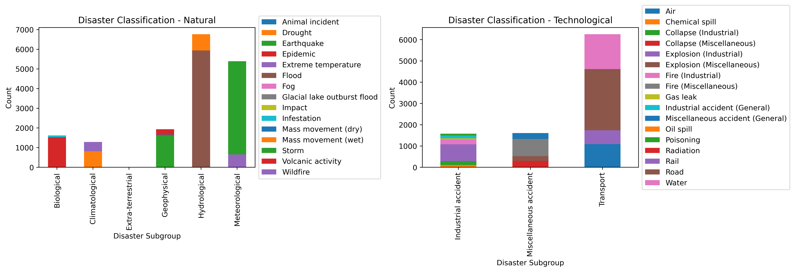
*Disaster Types present in the dataset.*

<!-- 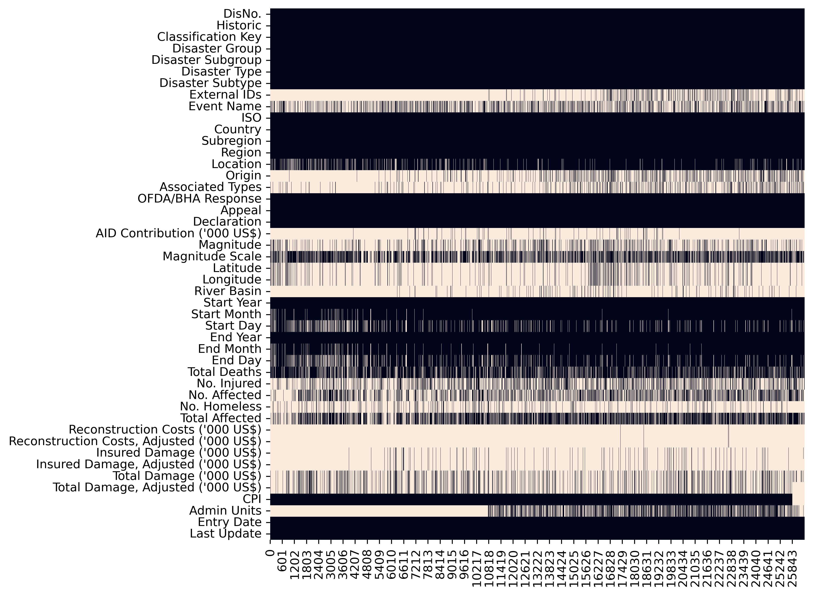
*Quantifying missing values: Heatmap for every variable across every sample (white implies missing).* -->

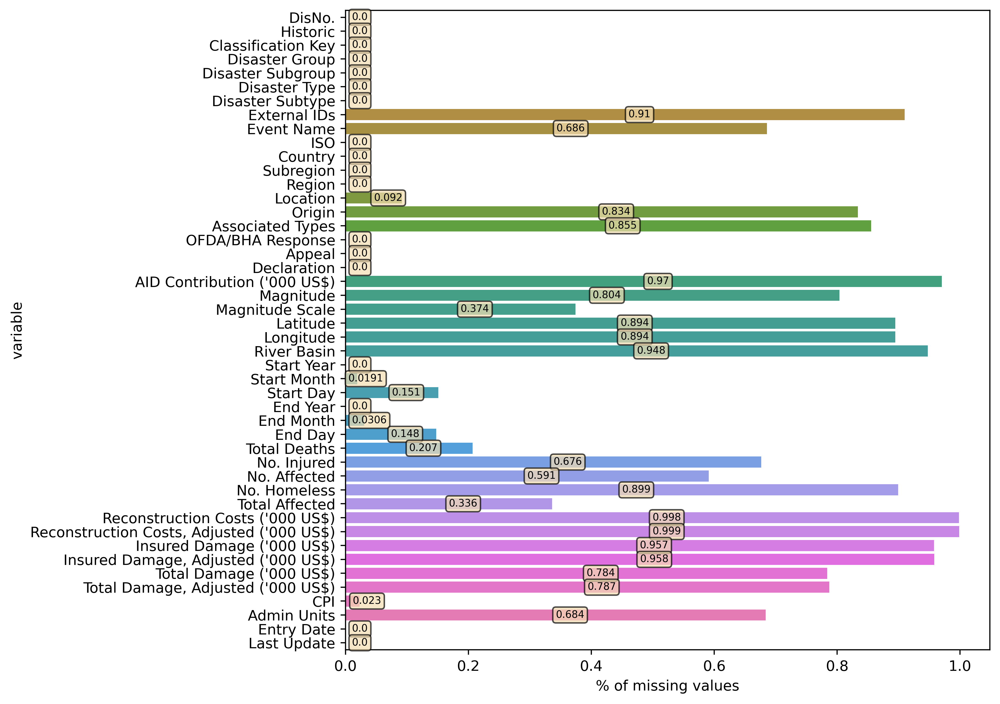
*Quantifying missing values: Percentage of missing values for every variable.*

<!-- 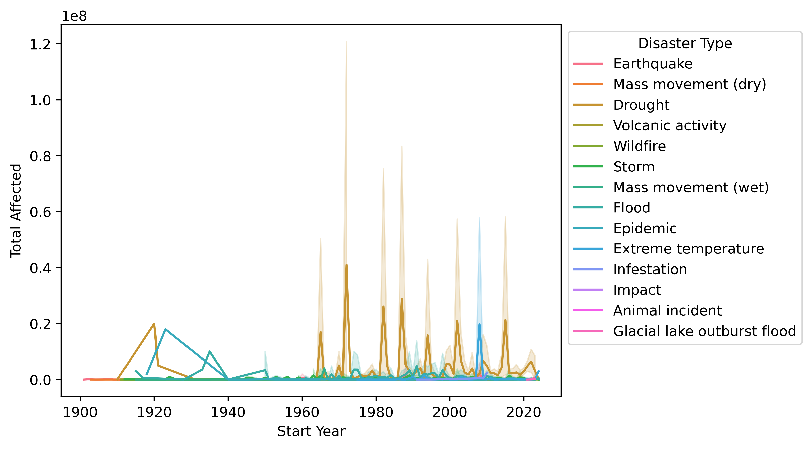
*Number of people affected by a disaster across years.* -->

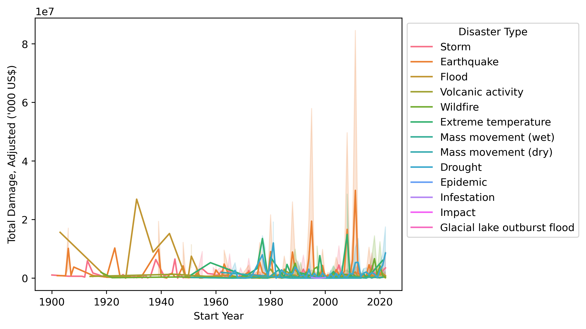
*Damage costs caused by a disaster across years.*

### 🌎 Related work

CRED already had use his own data to make [annual reports of disaster](https://www.cred.be/sites/default/files/2022_EMDAT_report.pdf), as well than [Our World in Data](https://ourworldindata.org/natural-disasters) and the [International Monetary Fund (IMF)](https://climatedata.imf.org/pages/climatechange-data), showing the dynamics of differents type of disasters per country/region with timeline visualisations, some of them have a nice aesthetic but lack of a more personalise interaction to play with differents metric.

Our approach to make this subject original is to have interactive charts with the possibility to change parameters and areas to focus on. You might only be interested in earthquakes worldwide, you are able to filter for that information. We are also building it so you can switch between different categories of disasters across all features. An original idea for this subject we are also going to implement is a visualisation of a time period where the evolution of events are seen on a world map and as a ranking of most impactful events through time. 

What also makes this original is that we plan to show the inequalities in response/help from other countries which is nothing we have been able to find anyone else representing in any form using this dataset.

We found some other sources with interesting visualisations that we plan to adapt for our subject. [This](https://www.youtube.com/watch?v=xDCaF_EUiaE&ab_channel=GlobalStats) visualisation we found is what we are planning to use to show the most impactful disasters through history. For the visualisation, we intend to update it for every year so the events get reranked. 

We also found a [density map](https://www.visualcapitalist.com/cp/3d-mapping-the-worlds-largest-population-densities/) like the following one. This map shows pillars where the height represents the number of people living there. We think this could potentially be used to show different disaster events, where the height could be something like magnitude, people affected or something else related. 

[This one](https://www.svt.se/datajournalistik/valu2022/valjarstrommar/), we are planning to use to show primary disasters leading to secondary disasters, for example an earthquake leading to tsunami or floods. 

## Milestone 2 (26th April, 5pm)

**10% of the final grade**

Initial website: https://com-480-data-visualization.github.io/project-2024-DisasterClass/

### Spike map of disasters through time
In our initial visualisation, we aim to illustrate the magnitude of disasters over history. As time progresses, each disaster will dynamically appear, showing its location and magnitude (e.g., total deaths) through spike lengths. However, due to the large number of events, the map may quickly become crowded.  Therefore, implementing a feature that allows users to filter by disaster group can enhance the visualisation, enabling users to observe different dynamics. While this approach may not facilitate in-depth analysis initially, its primary objective is to offer users an initial glimpse into the global scale and historical significance of disasters. Emphasising their widespread occurrence and geographical diversity, enrich our storytelling. One main aspect of the map is to highlight disasters individually.

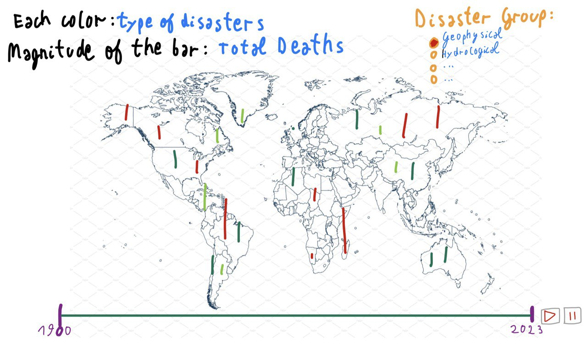

**Tools:** d3.js   **Lectures:** 8.-Maps, 5.-Interactions

### 5D Bubble Chart

For our second visualisation we plan on making a 5D bubble chart. The bubble chart’s x and y axes are devoted to two different continuous variables. The bubbles' centres correspond to the accumulation of the total values for each disaster type for a certain year. The radius of the bubble corresponds to the frequency of the disaster. The colour of the bubbles correspond to the type of disaster.

For example, say the user wants to look at the correlation between the total deaths and the duration of the different disaster types, in the year 2019. For each disaster type (earthquake, flood, hurricane, etc…), you would look at every event that started in the year 2019, count them (for the radius of the bubble), sum every value of total deaths and of durations together, then plot the centre of the bubble at these coordinates.

Some upgrades we could do with this plot are the following: make the bubbles dynamic by making the years change when you hit a play button; whenever you scroll over a bubble you get a popup window (rightmost box in the sketch) which gives you additional information about the specific disaster events; a toggle to switch between natural and technological disasters.

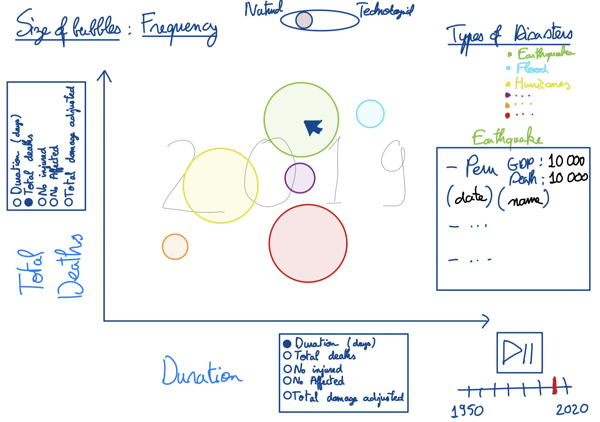

**Tools:** d3.js    **Lectures:** 4.-D3.js, 12.-Storytelling

### Individual disasters barchart race across time

For our third visualisation we would like to create a dynamic “race”. As such we would be able to see how each disaster event ranks against one another on a user defined continuous variable. As time is passing (by day or month) a barchart is being updated by accumulating the total value of the event (for example total deaths) and stops getting updated once the event ends. On each bar you would see additional text information about the event. The colour of the bar reflects the disaster type.

Possible upgrades : scale the plotting variable by a world population estimate to account for population growth.

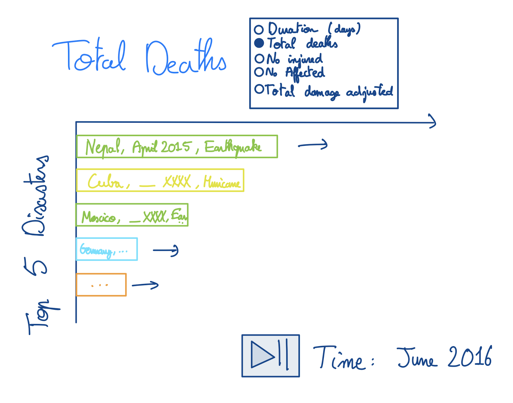

**Tools:** d3.js    **Lectures:** 4.-D3.js

### Sankey diagram showing disaster occurrences to certain months

The Sankey diagram is a powerful tool for visualizing the occurrences of various natural disasters over time. By juxtaposing each disaster type against months, it provides a clear snapshot of their frequency throughout the years. The width of the flow lines between disaster types and months directly correlates with the frequency or number of occurrences, offering an intuitive grasp of the data.
This visualisation helps identify patterns such as peak months for specific types of natural disasters. For instance, if floods are most common in June and hurricanes are prevalent in September, the Sankey diagram will clearly show thicker lines leading from those disaster types to those respective months.

Upgrades:
Adding a toggle between the northern and southern hemisphere to see more accurately how the seasons correlates with the month, because the seasons are switched between the hemispheres. Otherwise, you could add an extra layer representing the hemisphere. Another upgrade would also be to allow the user to choose a specific or a few disasters to get a clearer visual of the relation between the variables. Adding colours to it could also make it more visually pleasing. 

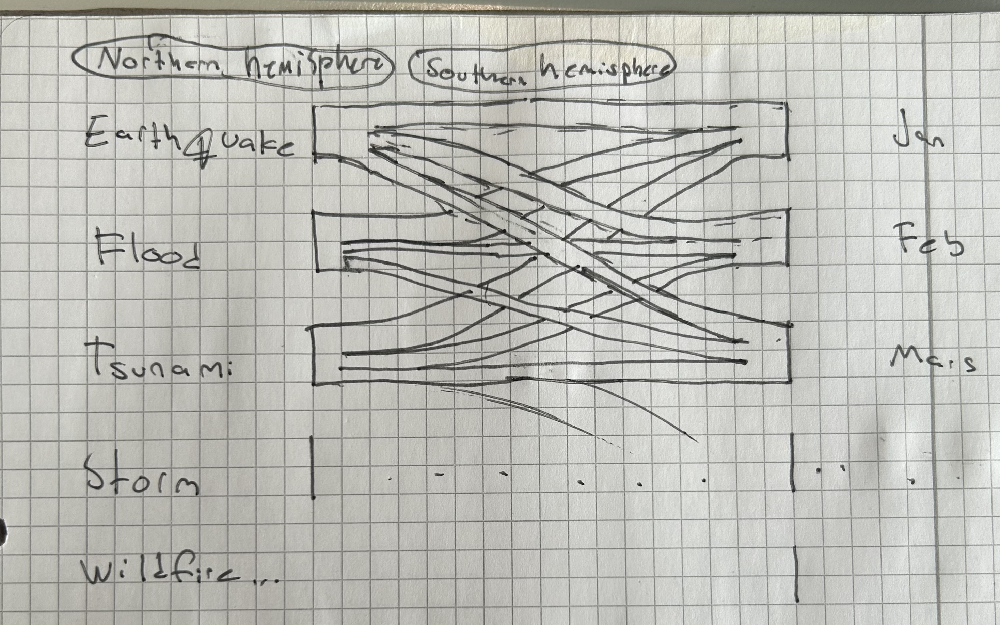

**Tools:** d3.js    **Lectures:** 4- D3.js

### World Choropleth Disasters Inequalities 

Our final visualisation will feature a choropleth map, offering a clear visual experience. Its primary goal is to empower users to explore dynamic disasters among countries. We'll emphasise metrics such as the percentage or frequency of times a country requested international aid (Appeal) or declared a state of emergency in response to disasters.
Some potential additional features could include allowing users to explore the diversity of disaster types, considering each country's land area to avoid bias towards larger states. To further refine the analysis, users will have the option to set a minimum threshold for disaster magnitude, allowing them to focus on events with significant impact rather than those with high occurrence but low impact.
By enabling users to delve into various dynamics and observe how different variables can lead to distinct conclusions, our visualisation aims to shed light on inequalities and disparities across regions.

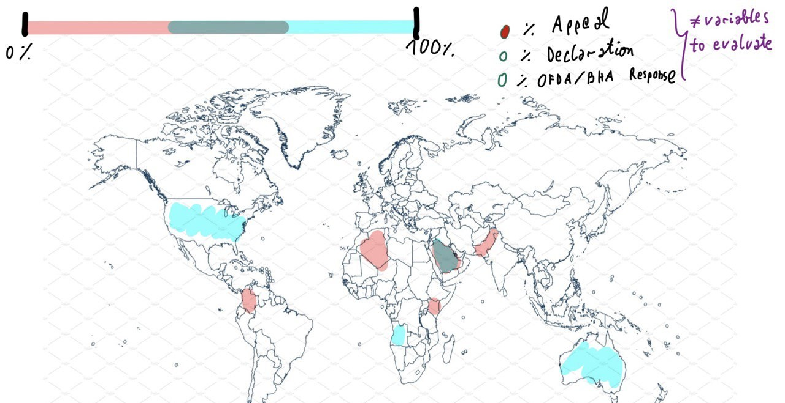

**Tools:** d3.js    **Lectures:** 8.-Maps, 5.-Interactions

## Milestone 3 (31st May, 5pm)

**80% of the final grade**

## Late policy

- < 24h: 80% of the grade for the milestone
- < 48h: 70% of the grade for the milestone

